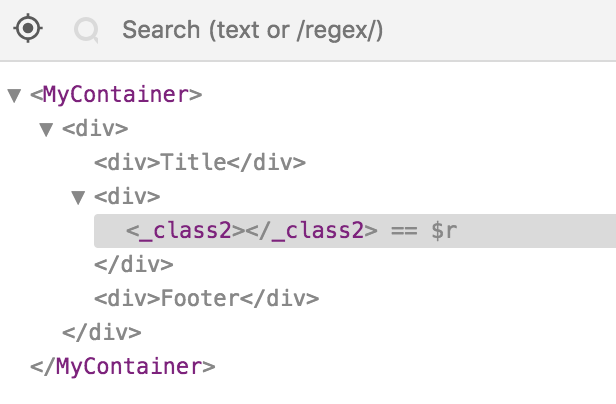

This test app shows that ExtReact components don't work with "normal" React
components in ExtReact 6.6.

See `src/main.js` for more info.

The cell renderer in `src/App.js` is affected by a very similar bug: it's
possible to render text, but not JSX.

Also, it's impossible to debug ExtReact components with the React extension
for Chrome:

